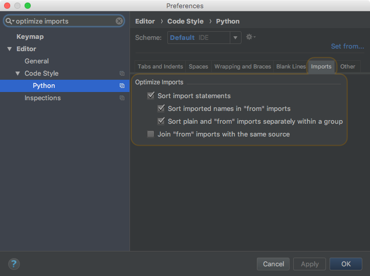

***************************
Contributing to cloudigrade
***************************

First of all, thank you for considering contributing to **cloudigrade**! 😀 The project maintainers are developers at Red Hat, but we'd welcome additional contributions from the broader community. Please take a look at this document to see how you can best help us out.

.. contents::

Issues
======

Filing a bug
------------

Our default issue template is formatted for user stories since we chiefly follow an agile scrum process for developing **cloudigrade**. However, if you find a bug, please replace the default description on a new issue with the following information:

- a brief summary of the bug
- steps to reproduce the problematic behavior
- actual undesired output given a particular input
- expected output given a particular input

If you believe there are tests passing that shouldn't be, please include references to them and explain why you think they may be wrong.

Bug issues should be tagged on GitHub with the ``bug`` label.

Requesting a feature
--------------------

We use `ZenHub <https://www.zenhub.com>`_ to supplement GitHub's issue tracker to guide development through a scrum process. Our default GitHub issue template is formatted specifically for treating *feature requests* as *user stories* in scrum.

If you are unfamiliar with the concepts of user stories or scrum, please take a look at:

- `What is a user story? <https://www.mountaingoatsoftware.com/agile/user-stories>`_
- `What is scrum? <https://www.mountaingoatsoftware.com/agile/scrum>`_

In GitHub's issue tracker, a user story should be tagged with the ``story`` label and contain the typical "As a <type of user>, I want <some goal> so that <some reason>" description with a list of more detailed acceptance criteria that must be met before the feature should be considered complete. The more you explain about *why* you need a feature and *what* its acceptance criteria are, the more likely we will understand your needs and help complete the work.

Issues that are more investigative in nature may instead be tagged with the ``spike`` label and have a simplified description containing a brief explanation of the expected output. Since spikes typically just involve performing research and proposing a solution, we typically include a timebox in the description and omit story points during backlog refinement.

Issue life cycle in scrum
-------------------------

On `the cloudigrade board at ZenHub <https://app.zenhub.com/workspace/o/cloudigrade/cloudigrade/boards>`_, an issue typically goes through the following steps:

- Create an issue in the **New Issues** state with some basic (but perhaps incomplete) definition.
- We discuss the issue at `backlog refinement <https://www.mountaingoatsoftware.com/blog/product-backlog-refinement-grooming>`_, and when we are confident we have enough information to start working, we add a `story point estimate <https://www.mountaingoatsoftware.com/blog/what-are-story-points>`_ and move the issue to **Backlog**.
- During `sprint planning <https://www.mountaingoatsoftware.com/agile/scrum/meetings/sprint-planning-meeting>`_, if the issue is sufficiently high in priority, we move the issue from **Backlog** to **To Do**, indicating that we expect to complete the work in the new sprint. The issue must also be assigned to the **milestone** for the current sprint.
- A developer moves the issue to **In Progress** when work starts on it.
- As work on an issue nears completion, the developer opens a pull request for the changes and moves the issue to **Review**.
- Developers and stakeholders review the code, tests, and a demonstration of the changed behavior. Only after everyone is satisfied do we accept the pull request and move the issue to **Closed**.
- Celebrate as the changes go live! 🎉

Coding style
============

**cloudigrade** is written mostly in Python with support targeting the latest release versions of Python 3.6 and pypy3.

We enforce consistency in the code using `Flake8 <https://pypi.python.org/pypi/flake8>`_ with the following additional plugins enabled:

- `flake8-docstrings <https://pypi.python.org/pypi/flake8-docstrings>`_
- `flake8-quotes <https://pypi.python.org/pypi/flake8-quotes>`_
- `flake8-import-order <https://pypi.python.org/pypi/flake8-import-order>`_

This means that all our submitted code conforms to `PEP 8 <https://www.python.org/dev/peps/pep-0008/>`_ standards.

All code **must** cleanly pass Flake8 checks before it can be accepted. Occasional exceptions may be made to skip checks with ``# noqa`` comments, but these are strongly discouraged and must be reasonably justified.

Imports must follow the ``pycharm`` style. If you are using PyCharm as your IDE, you can coerce it to use a compliant behavior by configuring your settings as follows:

Alternatively, you may use the command-line tool `isort <https://pypi.python.org/pypi/isort>`_ which has default settings that match closely enough for **cloudigrade**. `isort` can be used to automatically clean up imports across many files, but please manually review its changes before committing to ensure that there are no unintended side-effects. Example usage:

.. code-block:: bash

    # view diff of suggested changes
    isort -df -rc ./cloudigrade/

    # apply all changes to files
    isort -rc ./cloudigrade/

Contributing code
=================

**cloudigrade** code lives on `GitHib <https://github.com/cloudigrade/>`_, and all contributions should be submitted there via pull requests.

Branching strategy
------------------

**cloudigrade** follows a simplified `git flow <http://nvie.com/posts/a-successful-git-branching-model/>`_. The ``master`` branch is production-like and reflects the state of the released/live running service at any time (thanks to continuous deployment). All in-development work lives in other branches. We do *not* have perpetual ``develop`` or ``release`` branches. Changes are introduced to master through pull requests directly from short-lived feature branches.

Merge commits are not allowed on master. You must use rebase to keep the history lineage clean and comprehensible, and we encourage you to squash commits within your branch to minimize noise. If you are uncomfortable rebasing history, you may use merge commits on your personal development branch as long as your entire branch is squashed when it lands on master.

Ideally, commits are *atomic* in the sense that they contain everything necessary and related to a particular behavior change. Drop or squash all commits that just act as "work in progress" checkpoints.

When you create a branch for your change, we *prefer* you use a short title that is prefixed by the GitHub issue number it is resolving. This allows us to quickly spot the connection without digging through links or commit messages. For example, here are the names of some previous short-lived branches:

- ``105-polymorphic-api``
- ``28-save-on-off-events``
- ``52-dockerize``

Pull requests
-------------

When you submit your pull request, include a link in the description to the issue that the code change is addressing. Pull requests must be assigned to the **milestone** for the current sprint by a maintainer before we accept it. With ZenHub, pull requests should also be connected to the relevant issue.

**cloudigrade** has enabled the following third-party integrations that must complete for any pull request:

- `Travis CI <https://travis-ci.org/>`_ for running Flake8 and tests and building artifacts
- `codecov <https://codecov.io/>`_ for tracking and enforcing tested code coverage
- `pyup <https://pyup.io/>`_ for checking dependency versions

If the person who created the pull request is a project maintainer, that person is also responsible for accepting and closing the pull request after receving review approval from others.

Test coverage
-------------

All code changes should be accompanied by automated tests to cover the affected behavior and lines of code. Ideal submissions include tests to cover "happy path" cases, error cases, and known edge cases.

**cloudigrade** tests run in tox's ``py36`` and ``pypy3`` environments, both of which run on Travis CI and are required to pass cleanly before we can accept a pull request. The full test suite should take on the order of seconds to complete, and because the tests are reasonably fast, we encourage contributors to run all tests before submitting any changes.

We strive for very high coverage of our code by tests, and any code additions or changes that reduce our rate of coverage should be justified. The codecov integration will comment on pull requests and halt the process if coverage drops below our project thresholds.

Code reviews
------------

At least one project maintainer must review the changes before the pull request may be accepted. Reviewers may add comments and request additional changes; so, please watch for any notifications and respond accordingly.

Code reviews are a "safe place" where everyone should be willing to accept questions, feedback, and criticism. This is a place for us to learn from each other and improve the quality of the collective code. Please disassociate criticism in the reviews from your personal ego; *you are not your code*.

Running code checks and tests locally
=====================================

Once your environment is set up, simply use ``tox``:

.. code-block:: bash

    # run all tests and code quality checks
    tox

    # run only tests for Python 3.6
    tox -e py36

    # run only code quality checks
    tox -e flake8
