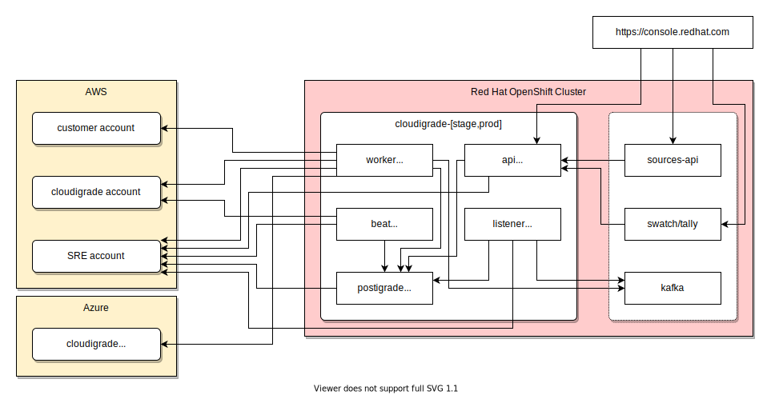
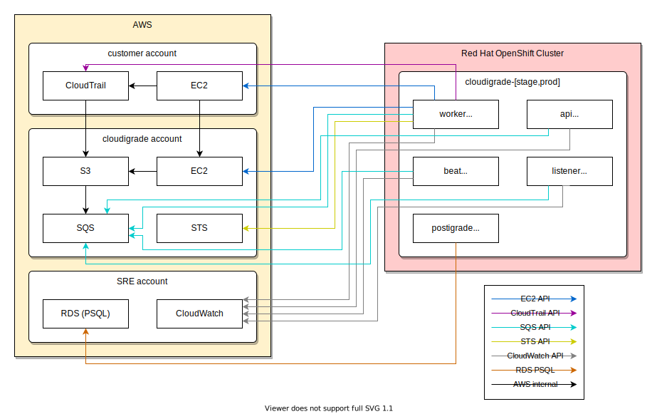

# cloudigrade Architecture Document

## Overview

cloudigrade is a service that monitors, tracks, and reports on RHEL instance activity in public clouds for Red Hat customers. See [README.md](https://github.com/cloudigrade/cloudigrade/blob/master/README.rst) and [Adding sources for public cloud metering](https://access.redhat.com/documentation/en-us/subscription_central/2021/html/getting_started_with_the_subscriptions_service/assembly-adding-sources-publiccloudmetering) for more general information.

Please note that cloudigrade is still under active development, and all parts of this document are subject to change. This document may not always keep up entirely with the pace of development.

## Technology Stack

cloudigrade is written in [Python 3](https://docs.python.org/3/) using [Django](https://www.djangoproject.com/) with [Django Rest Framework](https://www.django-rest-framework.org/) for HTTP APIs and model handling, [Celery](https://docs.celeryproject.org/) for asynchronous task processing, and [Poetry](https://python-poetry.org/) for managing its Python package dependencies. See cloudigrade's [Dockerfile](https://github.com/cloudigrade/cloudigrade/blob/master/Dockerfile) and [pyproject.toml](https://github.com/cloudigrade/cloudigrade/blob/master/pyproject.toml) for more details. cloudigrade records its data to a [PostgreSQL](https://www.postgresql.org/) database, typically pooled through [postigrade](https://github.com/cloudigrade/postigrade/) (a containerized [PgBouncer](https://www.pgbouncer.org/)).

cloudigrade deploys to AppSRE-managed projects in OpenShift using [app-interface](https://gitlab.cee.redhat.com/service/app-interface/) and [Clowder](https://github.com/RedHatInsights/clowder/) as defined by scripts and configs in [deployment](https://github.com/cloudigrade/cloudigrade/tree/master/deployment). When deployed to OpenShift using those tools, cloudigrade has several running deployments including:

- cloudigrade-api: the Django HTTP web service (scaled to many pods)
- cloudigrade-worker: asynchronous Celery workers (scaled to many pods)
- cloudigrade-beat: Celery beat for scheduled tasks (only *exactly one* pod)
- cloudigrade-listener: Kafka message queue reader (only *exactly one* pod)
- cloudigrade-metrics: Prometheus metrics exporter for Celery tasks (scaled to many pods)
- postigrade: PgBouncer proxy/pool to AWS RDS (scaled to many pods)

Upon deployment, cloudigrade automatically configures various resources for its own AWS account using [Ansible](https://www.ansible.com/) playbooks defined in [playbooks](https://github.com/cloudigrade/cloudigrade/tree/master/deployment/playbooks).

## Dependencies

cloudigrade has the following operational dependencies. See also [app.yml](https://gitlab.cee.redhat.com/service/app-interface/-/blob/master/data/services/insights/cloudigrade/app.yml).

- Red Hat/internal:
  - [OpenShift](https://openshift.com) ([status](https://status.pro.openshift.com/)) service hosting. If OpenShift is down or misbehaving, cloudigrade's APIs and tasks may stop running or fail, and that may result in pods restarting.
  - [Quay.io](https://quay.io) ([status](https://status.quay.io/)) as container registry. If Quay is down or misbehaving, cloudigrade's deployments may fail.
  - [App-SRE Jenkins](ci.ext.devshift.net) for various build jobs. If ci.ext is down or misbehaving, cloudigrade's PR checks may fail and new changes may not result in images in Quay.
  - [app-interface](https://gitlab.cee.redhat.com/service/app-interface/) to define and trigger OpenShift configuration changes. If app-interface is down or misbehaving, configuration changes and deployments may fail.
  - [Clowder](https://github.com/RedHatInsights/clowder/) operator running in OpenShift to manage deployments. If Clowder is down or misbehaving, configuration changes and deployments may fail.
  - [postigrade](https://github.com/cloudigrade/postigrade/) to proxy and pool database connections to AWS RDS. If postigrade is down or misbehaving, cloudigrade's APIs and tasks may stop running or fail, and that may result in pods restarting.
  - [Sources API](https://github.com/RedHatInsights/sources-api-go/) (see also [legacy version](https://github.com/RedHatInsights/sources-api/)) as primary source of customer cloud accounts. If sources-api is down or misbehaving, cloudigrade may not know about changes to customer accounts and whether or not to track them.
  - Platform-managed Kafka for sending and receiving messages between cloudigrade and other platform services. If Kafka is down or misbehaving, communication with sources-api may fail, cloudigrade may not know about changes to customer accounts and whether or not to track them, and sources-api may not have accurate availability for sources.
- External:
  - [GitHub cloudigrade project](https://github.com/cloudigrade/) for source code repositories and development. If GitHub is down or misbehaving or the cloudigrade repos are unavailable, developers may not be able to update code.
  - [GitHub bonfire repo](https://github.com/RedHatInsights/bonfire) for PR check bootstrap. If GitHub is down or misbehaving or the bonfire repo is unavailable, cloudigrade PR checks and IQE integration tests may fail.
  - [Sentry.io](https://sentry.io/) ([status](https://status.sentry.io/)) for error issue and performance transaction monitoring. If Sentry is down or misbehaving, cloudigrade devs may not be alerted to new runtime errors.
  - [Amazon Web Services (AWS)](https://aws.amazon.com/) ([status](https://status.aws.amazon.com/))
    - AWS customer account(s) to:
      - configure CloudTrail monitoring
      - describe EC2 resources
      - copy EC2 image snapshots
    - AWS cloudigrade account to:
      - describe known EC2 instance type definitions
      - use SQS queues for various processes
      - establish sessions with customer accounts (via STS)
      - read customer CloudTrail activity logs from S3
      - inspect EC2 images via [houndigrade](https://github.com/cloudigrade/houndigrade/) in EC2 cloud-init
    - AWS Red Hat SRE account to:
      - RDS PSQL database
      - Redis database
      - CloudWatch logging
    - If AWS is down or misbehaving, many of cloudigrade's internal operations may fail, and that may result in errors and pods restarting, and pods may fail to start completely and report ready.
  - [Microsoft Azure](https://azure.microsoft.com/) ([status](https://status.azure.com/)):
    - cloudigrade subscription to:
      - describe VM resource capability definitions
    - If Azure is down or misbehaving, many of cloudigrade's internal operations may fail, and that may result in errors and pods restarting, and pods may fail to start completely and report ready.

## Runtime Dependencies Overview

## AWS API Interactions Overview

## OpenShift Deployment Replicas

cloudigrade's `clowdapp.yaml` defines several OpenShift deployments, but some of them are defined to have only one replica. Here is a brief definition of each deployment and explanation of each's expected replica count:

- `cloudigrade-api` runs cloudigrade's [`gunicorn`](https://docs.gunicorn.org/) process to serve public and internal HTTP APIs. This deployment should have **several** replicas so that they can handle many simultaneous HTTP requests.
- `cloudigrade-worker` runs cloudigrade's [`celery worker`](https://docs.celeryq.dev/en/stable/userguide/workers.html) process. This deployment should have **several** replicas so that tasks can be processed by multiple workers in parallel and be completed in a timely manner.
- `cloudigrade-beat` runs cloudigrade's [`celery beat`](https://django-celery-beat.readthedocs.io/en/latest/) process. django-celery-beat is a scheduled and periodic task manager and is analogous to cron. This deployment should have **exactly one** replica because running multiple `celery beat` processes would result in the same task being executed multiple times which *at best* would waste resources or *at worst* cause a deadlock as two competing tasks try manipulating the same objects at the same time.
- `cloudigrade-listener` runs cloudigrade's `listen_to_sources` management command to read messages from sources-api's Kafka topics and call tasks to process them. This deployment should have **exactly one** replica because the order of messages from sources-api is important, and having multiple listeners may result in messages being processed out of order.
- `cloudigrade-metrics` runs cloudigrade's [`celery-exporter-container`](https://quay.io/repository/cloudservices/celery-exporter-container) process to serve an internal `/metrics` HTTP endpoint for Prometheus metrics gathering. This deployment should have **several** replicas so that they can handle many simultaneous HTTP requests.

Deployments that scale use standard OpenShift HPA definitions to maintain appropriate replica counts by targeting memory or CPU metrics. The minimum and maximum counts vary by deployment and environment. Defaults are defined in [clowdapp.yml](https://github.com/cloudigrade/cloudigrade/blob/master/deployment/clowdapp.yaml), and stage/prod-specific overrides are defined in [deploy-clowder.yml](https://gitlab.cee.redhat.com/service/app-interface/-/blob/master/data/services/insights/cloudigrade/cicd/deploy-clowder.yml).

## Resource Capacity and Growth

The dev team expects cloudigrade's CPU, memory, and disk use for both OpenShift and the RDS database to grow proportionally to the number of users, the length of time since a user joined, and the amount of activity in the users' cloud accounts.

How do those factors affect storage/database growth?

- cloudigrade retains information for each cloud account source for each user.
- cloudigrade retains information for each instance in each cloud account.
- cloudigrade retains information for each image used by each instance. When an image is shared by multiple instances, only one copy of the image's data is stored.
- cloudigrade retains information when each instance starts and stops for the known lifetime of each cloud account.
- cloudigrade retains calculated usage totals for each day for each user.

How do these factors affect CPU and memory?

- cloudigrade processes near-real-time events from the public clouds for each cloud account. This processing increases proportionally to the number of accounts and the amount of activity in those accounts.
- cloudigrade calculates daily usage totals for each user. This processing increases proportionally to the number of users. By default, cloudigrade only calculates daily usage in a sliding window. So, this process is generally unaffected by the lifetime age of the user.
- cloudigrade uses many asynchronous Celery workers to perform the required cloud data retrieval, processing, inspection, and calculation tasks. In general, as cloudigrade has more users and data, cloudigrade will need proportionally more OpenShift pods for workers to keep up with the increased number of tasks.

## Data Continuity and Disaster Recovery

- AWS RDS (PSQL):
  - All critical, persistent data for cloudigrade resides in AWS RDS (PSQL) instances which belong to and are managed by Red Hat's AppSRE team and infrastructure. cloudigrade's RDS resources are defined in app-interface's [cloudigrade-prod.yml](https://gitlab.cee.redhat.com/service/app-interface/-/blob/master/data/services/insights/cloudigrade/namespaces/cloudigrade-prod.yml) and [stage-cloudigrade-stage.yml](https://gitlab.cee.redhat.com/service/app-interface/-/blob/master/data/services/insights/cloudigrade/namespaces/stage-cloudigrade-stage.yml) for prod and stage respectively.
  - In case of a database disaster, AppSRE would need to recreate that database and restore the latest backup. Furthermore, cloudigrade deployments automatically check and apply schema migrations upon startup. So, if migrations were lost in the disaster, deploying cloudigrade will automatically update an out-of-date schema.
- AWS S3 buckets:
  - cloudigrade collects customer activity data via AWS's CloudTrail service which is configured to automatically send its logs to S3 buckets that reside in cloudigrade's AWS account. cloudigrade also collects image inspection results from houndigrade into S3 buckets that reside in cloudigrade's AWS account. Permissions are automatically applied to these buckets to allow only our AWS account (bucket owner) to list and read their objects. Lifecycle policies are applied to these buckets to automatically migrate files to Standard-IA at day 30, to Glacier at day 60, and to expire at day 1460. We *do not* actively back up S3 buckets because we consider their objects to be transactional.
  - *No actions* need to be taken to recover the data in these buckets. cloudigrade automatically recreates missing S3 buckets as needed.
- AWS SQS queues:
  - cloudigrade uses AWS SQS to receive notifications from S3 when new files arrive. We *do not* actively back up SQS queues data because we consider their messages to be transactional.
  - *No actions* need to be taken to recover the data in these queues. cloudigrade automatically recreates missing SQS queues as needed.
- Redis:
  - Deployed via clowder.
  - cloudigrade uses Redis for Celery's task message broker. We *do not* actively back up Redis queues data because we consider their messages to be transactional.
  - *No actions* need to be taken to recover the data in these queues. cloudigrade automatically recreates missing Redis queues as needed.
- Local filesystems:
  - Local filesystems on deployed pods *do not* keep any business-critical data.
  - *No actions* need to be taken to recover the data in these queues. Simply destroy and recreate deployments and pods as needed.

In summary, the cloudigrade database in AWS RDS is the *only* critical data store that may need to be recovered following a disaster. All other stores are either ephemeral or transactional and *do not* need to be recovered.

## Data Loss Impact

If there is a disaster that results in the database losing any data that previously had been recorded by normal cloudigrade operations, the dev team does not have a strategy to recreate the data lost during that gap. The overwhelming majority of cloudigrade's incoming data is either ephemeral or transactional and only read once. If there is any gap, Red Hat may need to notify customers about data loss during that time.

Consequences of data loss may include but are not limited to:

- CloudAccounts may disappear from cloudigrade for sources created in sources-api.
- CloudAccounts may continue to be active in cloudigrade for sources paused or destroyed in sources-api. cloudigrade's periodic account cleanup jobs should stop these within 24 hours.
- CloudAccounts may be disabled in cloudigrade for sources that were unpaused in sources-api. Normal activity should resume within a few hours as a result of sources-api's periodic availability checks.
- Recorded customer activity from AWS or Azure that notified and was processed by cloudigrade may disappear.
- Recorded customer image inspections may disappear, and they may not be able to inspect again if enough time has elapsed that the original image is no longer available.
- Calculated daily concurrent usage may be inaccurate for the date(s) of the data loss.

cloudigrade does not retain or report any personally identifying information (PII) or critical financial records. Losing data in cloudigrade due to a disaster only noticeably affects the displayed RHEL usage data in Subscription Watch graphs and tables on console.redhat.com. The graphs and tables might show zero or smaller-than-actual numbers for public cloud RHEL use during the period when data was lost. Reported usage before and after the loss period should be accurate.
