************************
cloudigrade architecture
************************

.. contents::

Overview
========

cloudigrade interacts with end users and public clouds by:

- exposing a REST API for managing users and accounts, viewing collected data, and producing usage reports over specified time periods
- querying currently-running instances in the public cloud that belong to a user
- periodically reading activity logs in the public cloud that contain machine power on/off events from a user's account
- identifying products that exist in machine images that a user has run in the public cloud

Technologies
============

cloudigrade is built using `Python 3 <https://docs.python.org/3/>`_, `Django <https://docs.djangoproject.com/en/2.0/>`_, and `Celery <http://docs.celeryproject.org/en/latest/index.html>`_ running on `CentOS 7 <https://www.centos.org/>`_-based containers. cloudigrade's REST APIs are proxied behind `nginx <https://nginx.org/en/docs/>`_. cloudigrade persists account, instance usage data, and image inspection results to a `PostgreSQL <https://www.postgresql.org/>`_ database. cloudigrade uses a `RabbitMQ <https://www.rabbitmq.com/>`_ broker for its task and message queues. cloudigrade should be able to scale horizontally to run on as many instances as necessary to support additional web server and task worker load.

cloudigrade's asynchronous task workers orchestrate various time-variable operations in a cloudigrade account in the public cloud. These tasks read activity logs, copy snapshots, create volumes, and manage a special cluster that uses houndigrade to inspect the contents of attached volumes.

.. note:: Users with `AWS <https://aws.amazon.com/documentation/>`_ accounts must create an `IAM role <https://docs.aws.amazon.com/IAM/latest/UserGuide/id_roles.html>`_ with a custom policy that allows cloudigrade's account to perform various operations on behalf of that user. cloudigrade needs this role to see running instances, access `AMI <https://docs.aws.amazon.com/AWSEC2/latest/UserGuide/AMIs.html>`_ snapshots for copying, and use `AWS CloudTrail <https://aws.amazon.com/documentation/cloudtrail/>`_ to monitor instance activity in the user's account.

`houndigrade <https://github.com/cloudigrade/houndigrade>`_ is a small auxiliary Python program that cloudigrade executes inside a short-lived cloudigrade-owned instance in the public cloud. houndigrade inspects the contents of attached volumes, determines what relevant products exist for each volume, and reports its findings back to cloudigrade.

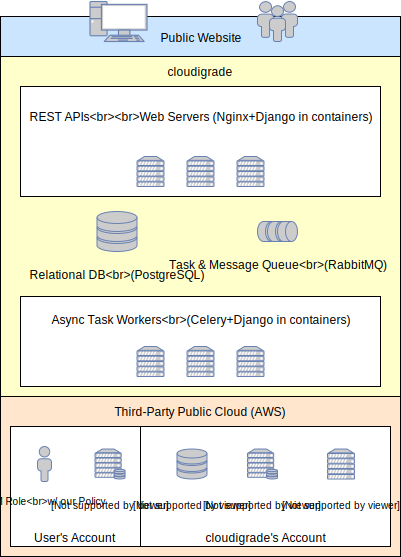

Workflows
=========

Register new cloud account
--------------------------

When a new user registers their cloud account with cloudigrade, cloudigrade verifies that it has access to the account, retrieves a list of currently running instances, saves information about the account and running instance, and launches asynchronous tasks to inspect any new, unrecognized images belonging to currently running instances.

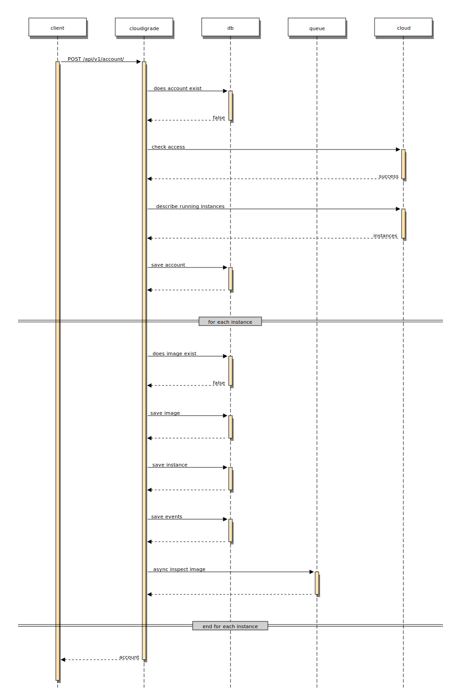

Periodic log checking
---------------------

cloudigrade periodically checks the public cloud's activity logs to discover any recent changes in user instance activity. Specifically, cloudigrade needs to know when instances are powered on or powered off so that it can correctly track instance usage.

With AWS, this process requires first checking AWS SQS for new messages, retrieving the full message contents from AWS S3 as referenced by the SQS message, and iterating through the full log contents to search for and persist any relevant information. If cloudigrade discovers any new, unrecognized machine images, it launches an asynchronous task to inspect it.

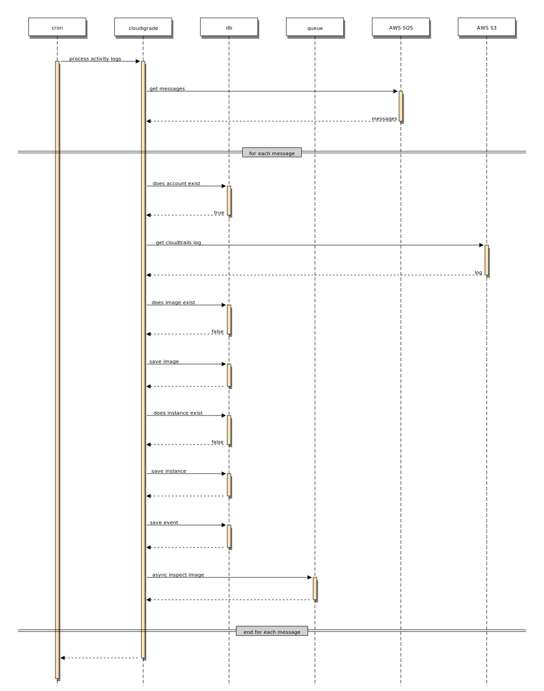

Async image inspection
----------------------

When cloudigrade encounters a user's image ID that it does not recognize, cloudigrade performs a sequence of asynchronous tasks to inspect that image. First, it calls a task to copy the image snapshot, then it calls a task to create a volume after the snapshot finishes copying, and then it calls a task to enqueue a message representing the created volume after the volume is ready.

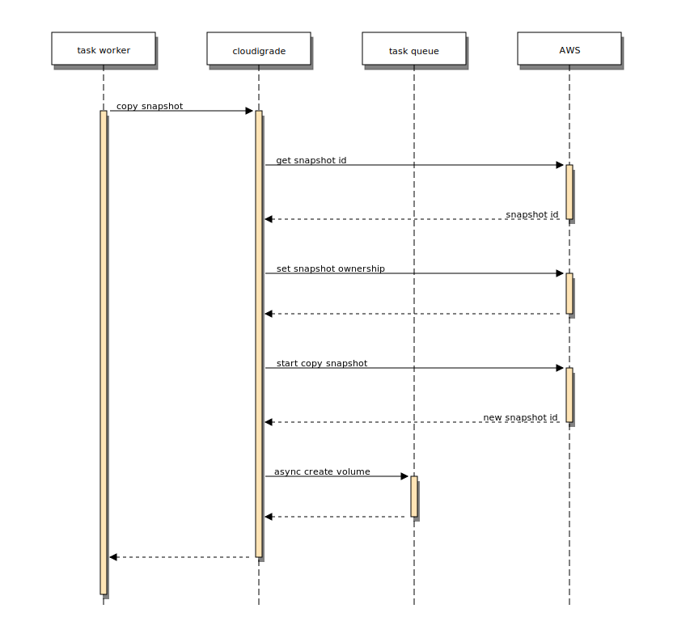

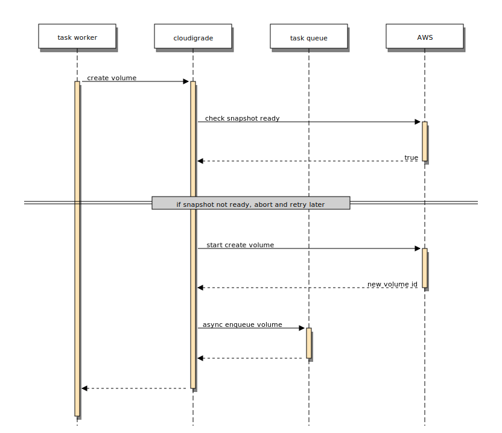

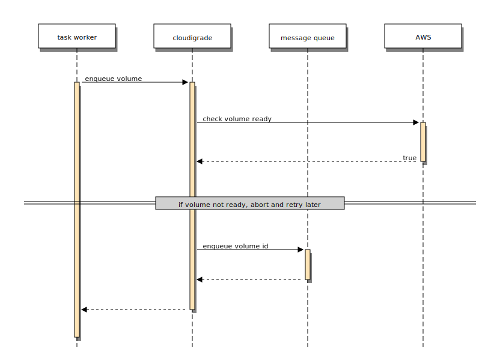

A periodic scheduled task dequeues a batch of ready volumes and prepares a special instance to do inspection, and then when the instance is ready, it calls a task to execute houndigrade in that instance with the volumes attached.

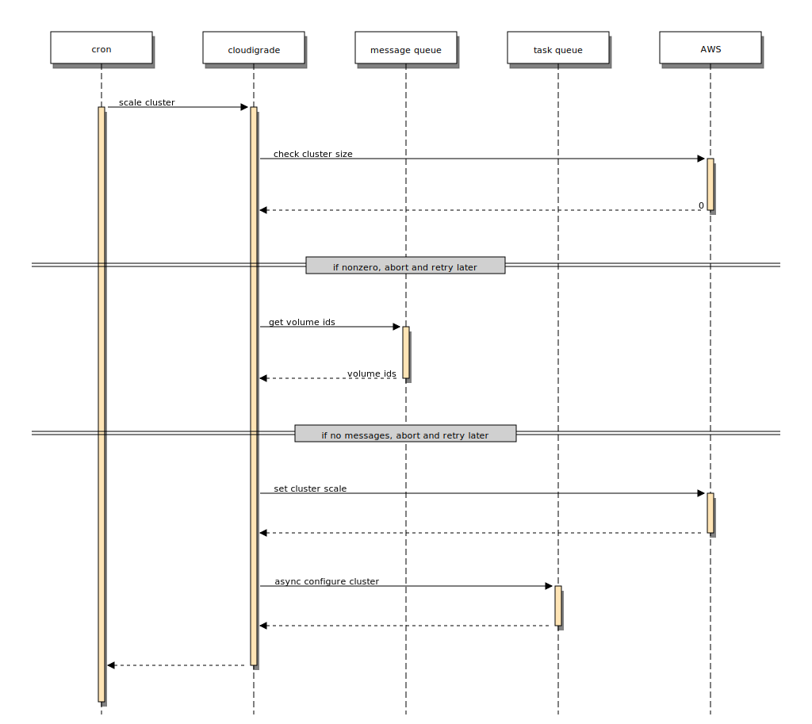

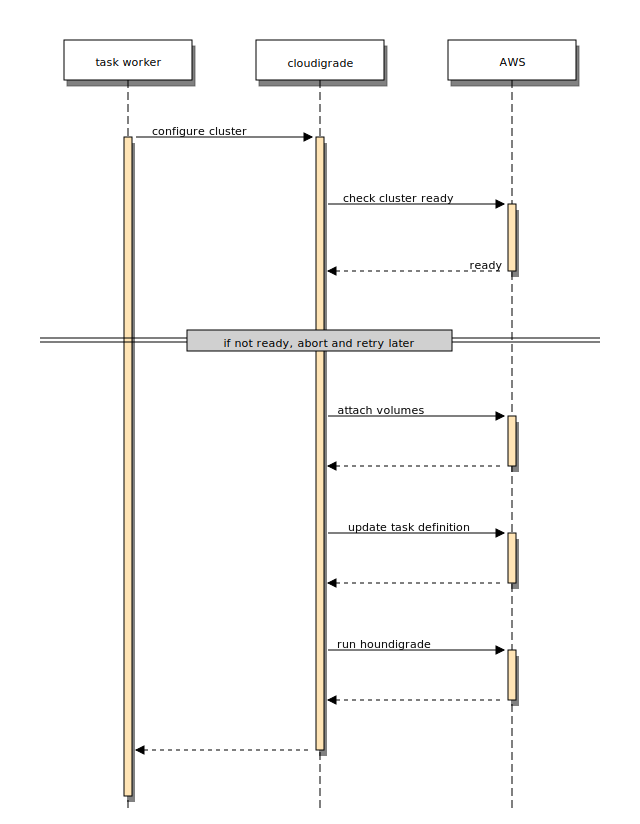

When houndigrade completes its inspection, it puts a message on a queue for cloudigrade containing houndigrade's inspection findings. When cloudigrade processes that message, cloudigrade calls a task to clean up the created snapshots, volumes, and instance used for inspection.

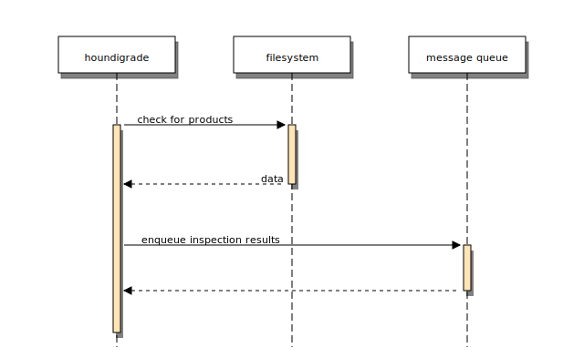

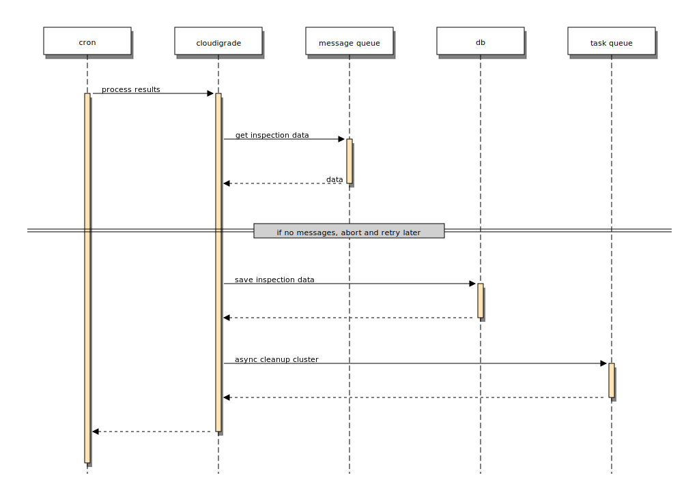

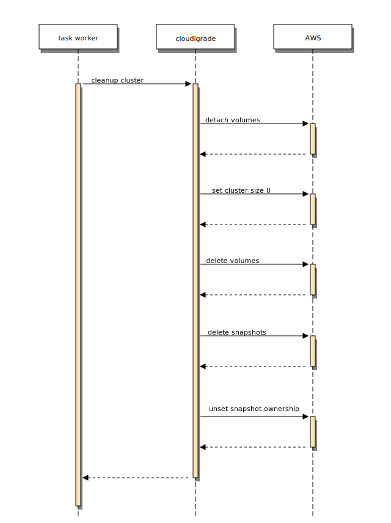
